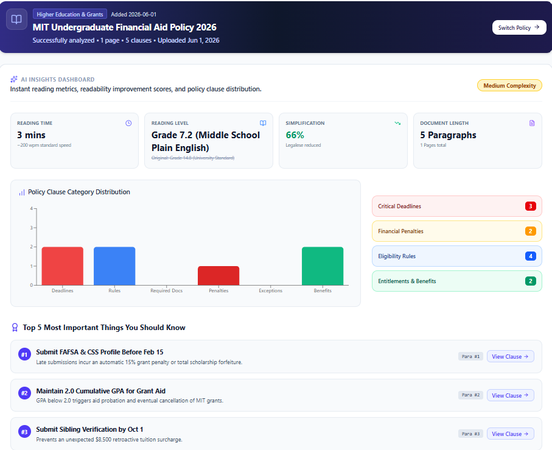
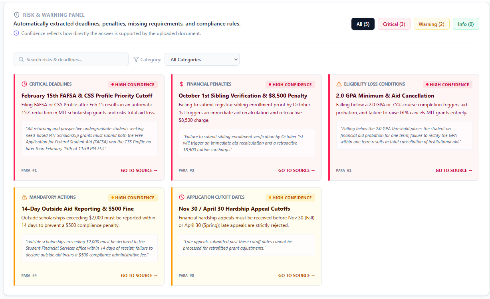
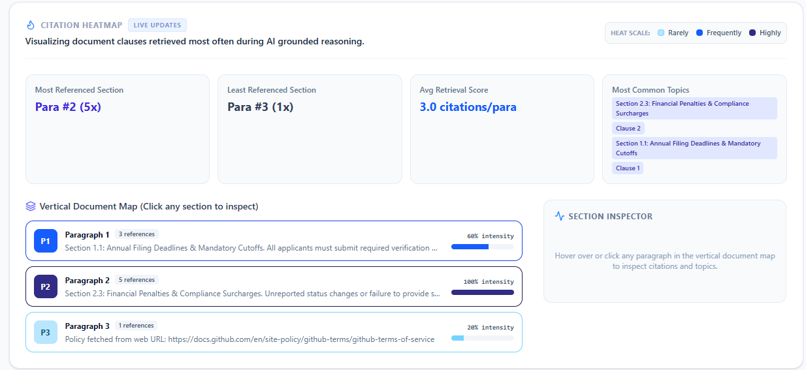
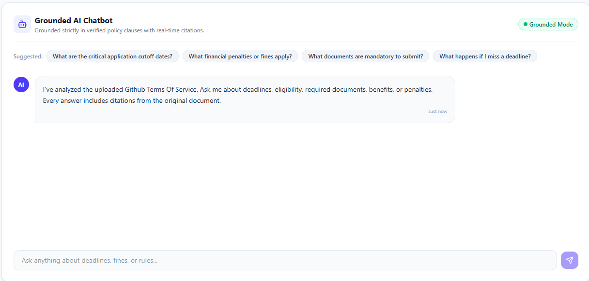
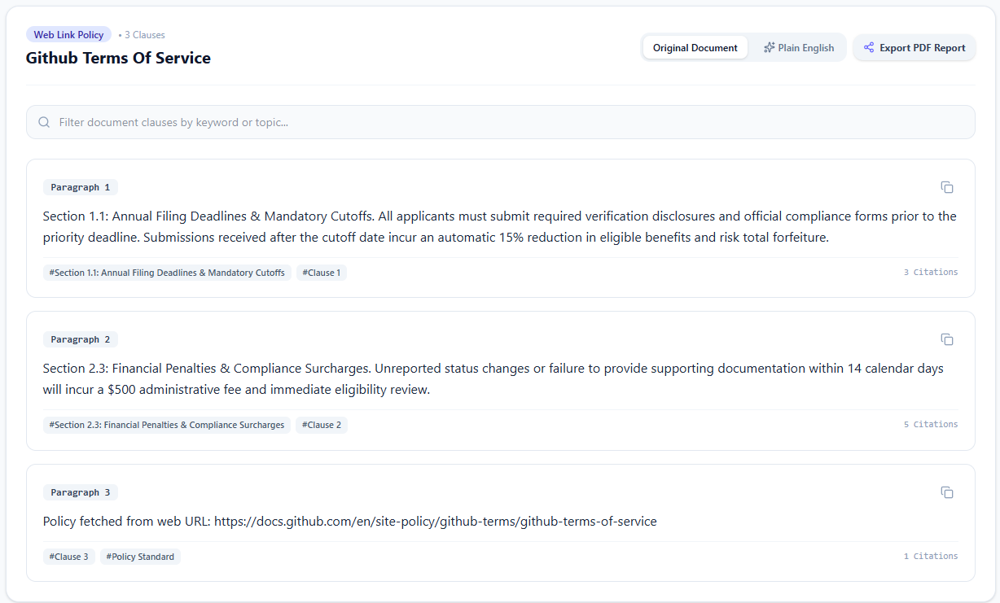
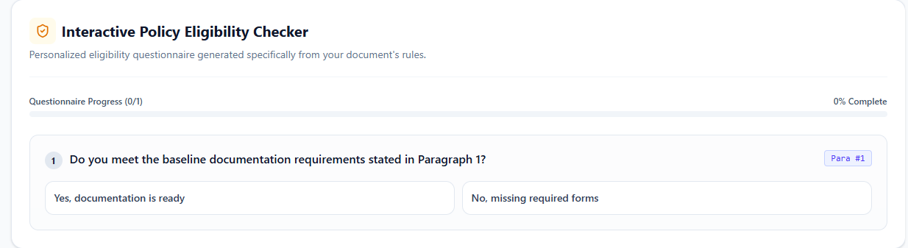
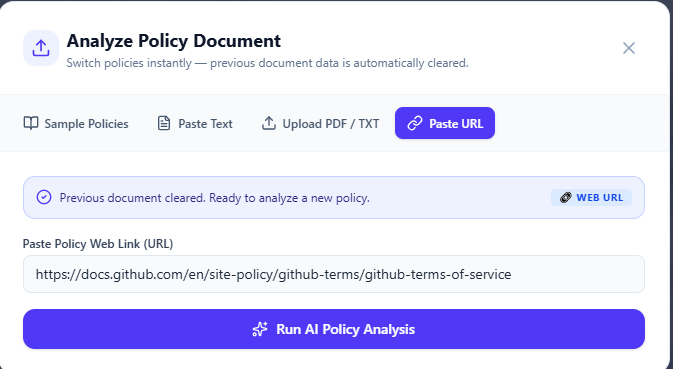

# Fathom

> **AI-Powered Policy Analysis & Intelligence Platform**
> 
> *Simplifying complex policies into plain English, detecting critical deadlines and risks, offering grounded Q&A with exact citations, and evaluating compliance through an interactive eligibility checker.*

---

[](https://react.dev)
[](https://www.typescriptlang.org)
[](https://vitejs.dev)
[](https://tailwindcss.com)
[](https://expressjs.com)
[](https://ai.google.dev)
[](LICENSE)

---

## 📌 Project Overview

**Fathom** is an intelligent web application designed to bridge the gap between dense legal, financial, academic, immigration, and tenancy jargon and clear, actionable understanding. 

Whether analyzing university grant guidelines, student visa work-hour limits, rental lease agreements, or corporate compliance documents, Fathom parses complex policy text in seconds. Powered by Google's **Gemini API** (`@google/genai`), Fathom automatically extracts critical deadlines, flags financial and legal penalties, translates clauses into Plain English, and enables real-time grounded Q&A with paragraph-level source citations.

---

## ✨ Features

- 📄 **Multi-Source Document Input**: Upload PDF or TXT files, paste direct web URLs, or enter raw policy text.
- ⚡ **Dynamic Clause & Heading Extraction**: Extracts actual document titles, clause headings, and structural sections automatically.
- 🚨 **Risk & Warning Panel**: Flags priority cutoffs, late submission penalties, expiration triggers, and compliance risks with clear confidence metrics.
- 🎯 **Grounded AI Chat**: 🎯 **Grounded AI Chat**: Ask natural language questions with document-grounded answers backed by exact paragraph citations.
- ✅ **Interactive Eligibility Checker**: Answer dynamic policy criteria questions to receive an instant **Estimated Result** (🟢 *Likely Eligible*, 🟡 *More Information Needed*, or 🔴 *Action Required*).
- 🔥 **Citation Heatmap**: Visual distribution tracking how frequently specific clauses are referenced across Q&A queries.
- 📊 **AI Insights Dashboard**: Analyzes reading difficulty scores, percentage simplification gains, complexity ratings, and key summary highlights.
- 🔄 **Smart Input Switching**: Seamlessly switch between documents or input methods with automatic data isolation and state resets.
- 🖨️ **Export-Ready Architecture**: Print-friendly CSS layouts for generating instant PDF analysis reports.

---

## 🖼️ Screenshots

### Dashboard & AI Insights


### Risk & Warning Panel


### Citation Heatmap & Clause Reference


### Grounded AI Chat with Source Citations

 
### Clause Reference


### Interactive Eligibility Checker


### Document Upload

---

## 🛠️ Tech Stack

| Layer | Technology | Usage |
| :--- | :--- | :--- |
| **Frontend** | React 19, TypeScript, Vite | Ultra-fast Single Page Application (SPA) framework |
| **Styling** | Tailwind CSS v4, Motion, Lucide Icons | Responsive modern UI with smooth micro-interactions |
| **Data Viz** | Recharts | Dynamic category distribution and metrics visualizer |
| **Backend** | Node.js, Express | Server-side API gateway proxying Gemini API requests |
| **AI Integration** | `@google/genai` (Gemini Flash) | Structured JSON policy analysis, risk extraction & grounded Q&A |

---

## 📁 Folder Structure

```text
Fathom/
├── assets/                  # Project static assets & screenshot images
├── data/                    # Pre-loaded sample policy documents
├── src/
│   ├── components/          # Reusable UI modules
│   │   ├── AIInsightsPanel.tsx
│   │   ├── CitationHeatmap.tsx
│   │   ├── DocumentUploadModal.tsx
│   │   ├── DocumentViewer.tsx
│   │   ├── EligibilityChecker.tsx
│   │   ├── GroundedChat.tsx
│   │   ├── Header.tsx
│   │   └── RiskWarningPanel.tsx
│   ├── utils/               # Helper utilities & title detection logic
│   │   └── titleDetector.ts
│   ├── App.tsx              # Main application container & view manager
│   ├── index.css            # Tailwind CSS styling entry point
│   ├── main.tsx             # React application DOM root
│   └── types.ts             # TypeScript interface declarations
├── server.ts                # Express backend server & Gemini API proxy
├── .env.example             # Environment variable template
├── metadata.json            # AI Studio app metadata configuration
├── package.json             # NPM dependencies & lifecycle scripts
├── tsconfig.json            # TypeScript compiler options
└── vite.config.ts           # Vite dev server & bundler configuration
```

---

## ⚙️ Installation & Setup

Follow these steps to run **Fathom** locally on your machine:

### 1. Clone the Repository
```bash
git clone https://github.com/rimshafareed510/Fathom.git
cd Fathom
```

### 2. Install Dependencies
```bash
npm install
```

### 3. Configure Environment Variables

Create a `.env` file in the project root and add:

```env
GEMINI_API_KEY=YOUR_GEMINI_API_KEY
```
Add your **Google Gemini API Key** to the `.env` file:
```env
GEMINI_API_KEY=YOUR_GEMINI_API_KEY_HERE
```
> *(You can acquire a free Gemini API key from [Google AI Studio](https://aistudio.google.com/)).*

### 4. Start the Development Server
```bash
npm run dev
```
Open your browser and navigate to `http://localhost:3000`.

---

## 💡 Usage Guide

1. **Upload or Select a Policy**: Click **Switch Policy** or **Upload Document**. Choose from curated samples (MIT Aid, Student Visa/PGWP, Tenancy Lease) or upload your own PDF/TXT file or paste a web URL.
2. **Review AI Insights & Risks**: View the top priority deadlines, fine surcharges, and reading difficulty ratings in the **Risk & Warning Panel** and **AI Insights**.
3. **Engage in Grounded Q&A**: Use the **Grounded Chat** to ask specific questions like *"What is the penalty for submitting late?"* or *"What GPA is required?"*. Click on any citation badge (`Para #1`) to jump straight to the exact clause in the document.
4. **Interactive Eligibility Test**: Answer the custom criteria questions in the **Eligibility Checker** to verify your compliance status against official policy rules.
5. **Inspect the Citation Heatmap**: Hover over paragraphs in the **Citation Heatmap** to analyze reference intensity across user queries.
6. **Export Analysis**: Click **Export PDF Report** to print or save a formatted document summary.

---

## 🔄 Project Workflow

```text
   [ Upload PDF / Paste URL / Paste Text ]
                     │
                     ▼
       [ Express Backend Proxy ]
                     │
                     ▼
      [ Google Gemini API Extraction ]
  (JSON Schema: Risks, Paragraphs, Questions)
                     │
         ┌───────────┴───────────┐
         ▼                       ▼
 [ Clause & Risk Extraction ]  [ Grounded Q&A Engine ]
         │                       │
         ▼                       ▼
 [ AI Insights & Heatmap ]    [ Citation & Source Jump ]
         │                       │
         └───────────┬───────────┘
                     ▼
       [ Interactive Eligibility ]
                     │
                     ▼
         [ Estimated Result Output ]
```

---

## 🚀 Future Improvements

- [ ] **Full Retrieval-Augmented Generation (RAG)**: Embed document chunks into vector stores for multi-page policy indexing.
- [ ] **Multi-Document Comparison**: Compare side-by-side revisions or competing policy options.
- [ ] **OCR Engine Integration**: Parse scanned PDF documents and image-based policy flyers.
- [ ] **Multilingual Policy Translation**: Translate plain-English summaries into 20+ languages.
- [ ] **User Accounts & Cloud Sync**: Persist uploaded user policies and audit logs in Firestore or PostgreSQL.

---

## 📄 License

This project is licensed under the **MIT License** - see the [LICENSE](LICENSE) file for details.

---

## 👤 Author

**Rimsha Fareed**

- 🐙 **GitHub**: [@rimshafareed510](https://github.com/rimshafareed510)
- 💼 **LinkedIn**: [Rimsha Fareed](https://www.linkedin.com/in/rimsha-fareed-73b157402/)

